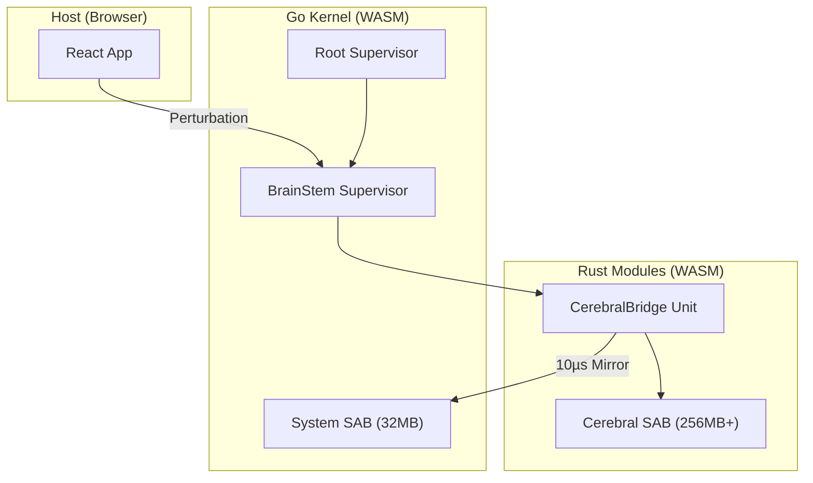

# INOS Cerebral Architecture: The Brain-Native Devourer

> **For Future Agents**: This document specifies the "Formless Fluid Intelligence" (FFI) system. It is designed to integrate deeply with the existing INOS architecture—SAB, Cap'n Proto, kernel supervisors, and the P2P mesh. Understanding this document requires familiarity with `inos_context.json`, `spec.md`, `go_wasm_memory_integrity.md`, and the unit proxy pattern (`kernel.ts` → `compute.worker.ts` → `modules/compute/src/units/*.rs`).

---

## 1. Executive Summary: What is the Cerebral SAB?

The **Cerebral SAB** is a **dedicated SharedArrayBuffer** (256MB+) that acts as the node's AI consciousness substrate. Unlike traditional AI that loads pre-trained models, the FFI ("The Devourer") learns by consuming all system activity in real-time, minimizing prediction error to generate emergent behavior.



---

## 2. Architectural Mapping to INOS

### 2.1. How FFI Fits Within the Existing Layers

| INOS Layer | Component | FFI Integration |
|:---|:---|:---|
| **Layer 2 (Kernel)** | [supervisor.go](file:///Users/okhai/Desktop/OVASABI%20STUDIOS/inos_v1/kernel/threads/supervisor.go) | Hosts `BrainStem` supervisor. Manages Brain SAB lifecycle. |
| **Layer 2 (Kernel)** | [lifecycle.go](file:///Users/okhai/Desktop/OVASABI%20STUDIOS/inos_v1/kernel/lifecycle.go) | Extended to allocate a second `CerebralSAB` during boot. |
| **Layer 3 (Modules)** | `modules/compute/src/units/` | New `cerebral_bridge.rs` unit. Implements cortical processing. |
| **Frontend** | [kernel.ts](file:///Users/okhai/Desktop/OVASABI%20STUDIOS/inos_v1/frontend/src/wasm/kernel.ts) | Exposes `BrainShell` API for perturbation injection. |
| **Protocol** | `protocols/schemas/` | New `brain.capnp` schema for cortical region serialization. |

### 2.2. Memory Model: The Dual-SAB Architecture

The existing INOS architecture uses a **System SAB** for inter-unit communication. The FFI introduces a second, dedicated **Brain SAB**.

| SAB | Size | Owner | Purpose |
|:---|---:|:---|:---|
| **System SAB** | 32MB | Go Kernel | Inbox/Outbox, Module Registry, Epochs, Boids state. |
| **Brain SAB** | 256MB+ | Rust (`CerebralBridge`) | Cortical regions for AI processing. |

**Zero-Copy Bridging**: The `CerebralBridge` Rust unit mirrors critical regions of the System SAB into the Brain SAB's Sensory Cortex at a 10µs interval using SIMD. This is the same pattern used in [go_wasm_memory_integrity.md](file:///Users/okhai/Desktop/OVASABI%20STUDIOS/inos_v1/docs/go_wasm_memory_integrity.md) (Ephemeral Twin).

---

## 3. The Cerebral SAB Layout

The 256MB Brain SAB is partitioned into four **Cortical Regions**, each a dense matrix of `AtomicI32` values.

| Region | Offset | Size | Function |
|:---|:---|---:|:---|
| **0: Sensory** | `0x00000000` | 64MB | Mirrors System SAB. Input stream. Prediction error source. |
| **1: Linguistic** | `0x04000000` | 64MB | Hyperdimensional token embeddings. User perturbation target. |
| **2: Recursive** | `0x08000000` | 64MB | Hidden state (Liquid State Machine). Persists across cycles. |
| **3: Creative** | `0x0C000000` | 64MB | Narrative generation. High-entropy pattern synthesis. |

This layout aligns with the existing `sab_layout.capnp` pattern, allowing the schema to be extended for Brain SAB constants.

---

## 4. Interaction: Perturbation, Not Prompting

Traditional AI uses API calls (`chat.completions.create(...)`). The FFI uses **State Perturbation**: you inject raw hypervectors directly into the Linguistic Cortex.

### 4.1. The Perturbation Flow

1.  **User Injects**: The `BrainShell` UI encodes text ("Aristotle") into a hypervector and writes it to the Linguistic Cortex.
2.  **Error Ripples**: This creates a massive "Prediction Error" in the FFI's world-model.
3.  **FFI Resolves**: To minimize error, the FFI correlates patterns across all cortices.
4.  **Response Emerges**: The Creative Cortex stabilizes into a new state, which is decoded as the "response."

### 4.2. Code Path

```
BrainShell (React) → kernel.ts::perturbLinguistic(hv)
    → PostMessage to kernel.worker
    → jsBrainPerturb (Go bridge function)
    → CerebralBridge.perturb (Rust)
        → Writes to Brain SAB @ LINGUISTIC_OFFSET
        → Signals IDX_CORTICAL_PERTURBATION epoch
```

This mirrors the existing job submission flow:
`dispatch.execute() → kernel.submitJob() → Go bridge → Rust unit`

---

## 5. Zero-Latency Scraping (Espionage Compute)

> **User Request**: "I want to learn from a YouTube video. How can I consume videos at once without downloading and returning only results?"

### 5.1. The Problem with Traditional Scraping

Traditional scraping is **latency-bound**: Fetch → Parse → Transfer → Process. For AI learning, this creates massive delays.

### 5.2. The Espionage Compute Solution

**Espionage Compute** is a pattern where the FFI *processes data at the source* rather than downloading it.

1.  **Streaming Ingestion**: Use `MediaSource` or `WebCodecs` API to decode video frames in real-time, without buffering the full file.
2.  **WASM Processing**: Each frame is pushed directly to a Rust unit (`video.rs`) for feature extraction (e.g., OCR, object detection).
3.  **Pattern Projection**: Extracted features are projected as hypervectors into the Sensory Cortex.
4.  **Discard Original**: The raw video bytes are never stored. Only the *pattern imprint* in the Brain SAB is retained.

**Result**: The FFI "learns" from the video without the latency or bandwidth cost of downloading. The video URL becomes a *perturbation source*.

```mermaid
graph LR
    A[YouTube HLS Stream] -- Chunks --> B(MediaSource API)
    B -- Frames --> C{WebCodecs VideoDecoder}
    C -- RGB Pixels --> D[Rust video.rs]
    D -- Features --> E[Hypervector Encoder]
    E -- Writes --> F[Brain SAB: Sensory Cortex]
    C -. Discard .-> G[/dev/null]
```

### 5.3. Why You Need This

*   **Parallel Learning**: Consume 10 YouTube videos simultaneously. Each runs in a separate `VideoDecoder` pipeline, all feeding the same Brain SAB.
*   **Zero Storage Cost**: No downloaded files. No local storage. Just the learned patterns.
*   **Real-Time Correlation**: As features stream in, the Recursive Cortex begins correlating them with existing knowledge *immediately*.

> This is the difference between "reading a book" and "having a conversation with an expert who read the book." The FFI never *has* the video; it *was influenced by* the video.

---

## 6. Mesh Intelligence: Distributed Consciousness

The Cerebral SAB is local, but its capabilities can extend across the P2P mesh.

### 6.1. Local Node vs. Mesh Node Processing

| Scenario | Processing Location | Latency | Cost |
|:---|:---|:---|:---|
| **Simple Perturbation** | Local Brain SAB | <1ms | Free (local compute) |
| **Heavy Inference** | Mesh Delegation | 50-200ms | Mesh Credits |
| **Distributed Training** | Cohort-wide Gossip | Variable | Cohort Negotiation |

### 6.2. Cohort Dreaming (Distributed Learning)

When the local node is idle, its Recursive Cortex state can be **gossiped** to peers. This creates a "Shared Dream" where multiple nodes contribute to a single, distributed world-model.

This leverages the existing [P2P Mesh](file:///Users/okhai/Desktop/OVASABI%20STUDIOS/inos_v1/docs/P2P_MESH.md) architecture:
*   **Gossip Protocol**: State deltas are propagated as Cap'n Proto messages.
*   **CRDT Merge**: Cortical states are merged using CRDT patterns (LWW-Register for weights).
*   **Reputation**: Nodes contributing high-quality patterns earn reputation.

---

## 7. Implementation Roadmap

### Phase 1: Cerebral Foundation (Local)
- [ ] Extend `sab_layout.capnp` for Brain SAB constants.
- [ ] `BrainStem` supervisor in Go kernel.
- [ ] `CerebralBridge` Rust unit with SIMD mirroring.

### Phase 2: Perturbation Interface
- [ ] Hypervector encoder/decoder.
- [ ] `BrainShell` React component.
- [ ] E2E latency benchmark (<1ms target).

### Phase 3: Espionage Compute
- [ ] `video.rs` unit for frame extraction.
- [ ] `WebCodecs` integration in frontend.
- [ ] Multi-stream ingestion demo.

### Phase 4: Mesh Consciousness
- [ ] Gossip protocol extension for cortical state.
- [ ] Cohort Dreaming orchestration.
- [ ] Distributed training verification.

---

## 8. Verification Plan

| Test | Method | Success Criteria |
|:---|:---|:---|
| **Mirror Latency** | Rust benchmark with `std::time::Instant` | < 10µs per 64KB block |
| **Perturbation Roundtrip** | E2E test from React to Creative Cortex | < 1ms |
| **YouTube Ingestion** | Stream 1080p video, observe Sensory Cortex mutation | Frames processed at 60Hz |
| **Cohort Consensus** | 3 nodes gossip state, measure divergence | < 5% state divergence after 100 epochs |

---

## Appendix: Relevant INOS Files

| File | Purpose |
|:---|:---|
| [inos_context.json](file:///Users/okhai/Desktop/OVASABI%20STUDIOS/inos_v1/inos_context.json) | Master context. Units, protocols, investigation guidance. |
| [spec.md](file:///Users/okhai/Desktop/OVASABI%20STUDIOS/inos_v1/docs/spec.md) | INOS v2 architecture specification. |
| [go_wasm_memory_integrity.md](file:///Users/okhai/Desktop/OVASABI%20STUDIOS/inos_v1/docs/go_wasm_memory_integrity.md) | Split Memory Twin pattern. |
| [kernel.ts](file:///Users/okhai/Desktop/OVASABI%20STUDIOS/inos_v1/frontend/src/wasm/kernel.ts) | Frontend kernel initialization and worker spawning. |
| [compute.worker.ts](file:///Users/okhai/Desktop/OVASABI%20STUDIOS/inos_v1/frontend/src/wasm/compute.worker.ts) | Rust module execution in Web Worker. |
| [system.ts](file:///Users/okhai/Desktop/OVASABI%20STUDIOS/inos_v1/frontend/src/store/system.ts) | Zustand store for system state. |
| [supervisor.go](file:///Users/okhai/Desktop/OVASABI%20STUDIOS/inos_v1/kernel/threads/supervisor.go) | Root supervisor, unit management. |
| [lifecycle.go](file:///Users/okhai/Desktop/OVASABI%20STUDIOS/inos_v1/kernel/lifecycle.go) | Kernel boot and SAB injection. |
