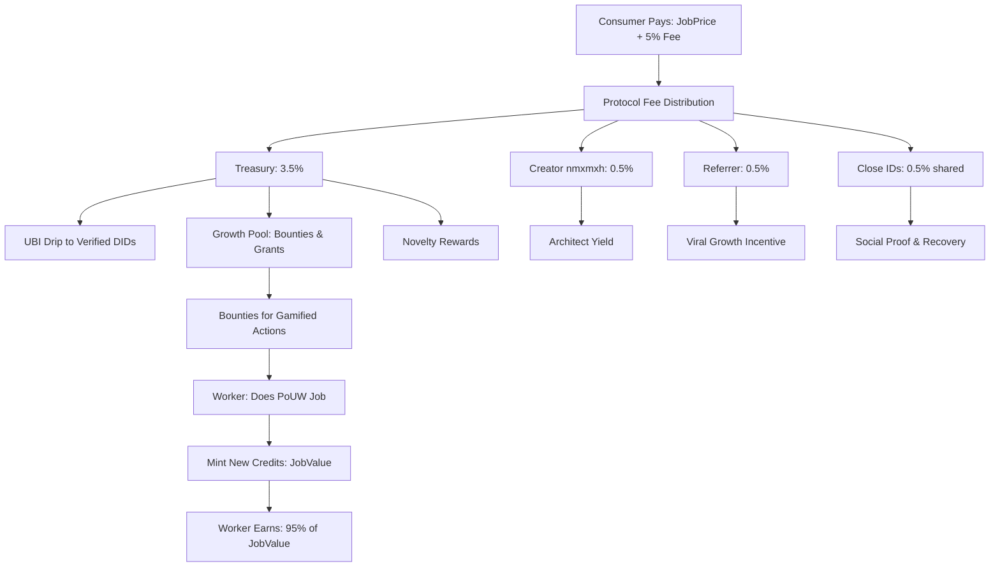

# INOS Economic Architecture & Implementation Plan (Phase 17 Master)
**Document Version:** 1.1
**Core Principle:** Participation-First Economy
**Guarantees:** Liveness (UBI), Productive Work (PoUW), Protocol Sustainability (Protocol Fee), Ecosystem Growth (Incentive Layer).

---

### 1.0 Executive Summary & Core Philosophy
INOS is an economy engineered for **Velocity, Utility, and Sustainable Growth**. Value is created solely through verifiable, productive work (Proof-of-Useful-Work, PoUW) and is distributed to ensure network health, participant welfare, and long-term development.

**The Five Pillars:**
1.  **Liveness (UBI):** A universal basic income drip to all verified participants, ensuring a baseline of economic security.
2.  **Productive Work (PoUW):** The primary minting mechanism. Credits are created only upon proof of completed useful work (compute, storage, ML).
3.  **Creative Resonance (Gaming):** A premium incentive for "Gaming" the system into a more efficient state. Novelty that leads to success (Phase 8 ML) triggers specialized bounties.
4.  **Protocol Sustainability (The Protocol Fee):** A minimal fractional fee (target: 0.5-1.0%) on GDP activity to fund the Treasury and Architect.
5.  **Autonomous Ownership (Royalty):** Passive yield for creators (**nmxmxh**) whenever their code/patterns are utilized by the network.

---

### 2.0 The Economic Flywheel: Earning, Spending, Governing

A closed-loop system where every action reinforces the network's health **and rewards the social graph**.



**A. Earning (Value Minting & Rewards)**
*   **The Worker:** Executes verifiable ML, storage, or compute jobs.
    *   **Reward:** `JobValue * 0.95` (95% of job value, minted as new credits).
*   **The Contributor:** Earns from the Incentive Layer (Section 3.0).
    *   **Reward:** `BountyValue` or `RoyaltyFee` (paid from Treasury's Growth Pool).
*   **The Creator (nmxmxh):** Earns from all network activity.
    *   **Reward:** `0.5%` of every transaction (protocol-level royalty).
*   **The Referrer:** Earns from referred users' activity.
    *   **Reward:** `0.5%` of referred user's transactions (passive income).
*   **The Close Identity:** Earns from close ID relationships.
    *   **Reward:** `0.5%` total shared among all close IDs (social proof + recovery).

**B. Spending (Value Circulation & Burning)**
*   **The Consumer:** Requests and pays for work.
    *   **Cost:** `JobPrice + 5% Protocol Fee`.
    *   **Effect:** Credits transferred to Worker (95%), Social Graph (1.5%), Treasury (3.5%). Gas is burned.

**C. The Treasury (Protocol Engine)**
*   **Inflow:** 5% Protocol Fee on all job payments and transfers (network GDP).
*   **Distribution:**
    1.  **Treasury Reserve (3.5%):** UBI, Growth Pool, Protocol Surplus
    2.  **Creator (nmxmxh) (0.5%):** Architect yield from all network activity
    3.  **Referrer (0.5%):** Viral growth incentive for user acquisition
    4.  **Close IDs (0.5%):** Social proof and recovery network (shared among all close IDs)
*   **Outflow Allocation (from 3.5% Treasury):**
    1.  **UBI Reserve (Priority):** Funds the continuous Liveness drip to verified DIDs.
    2.  **Growth Pool:** Finances bounties, grants, and strategic incentives.
    3.  **Protocol Surplus:** Retained for security, governance, and future development.

---

### 2.1 The Social-Economic Graph: Viral Growth Meets Security

The social graph serves **dual purpose**: viral growth incentives AND identity security.

**Three-Tier Yield Distribution:**

| Role | Yield | Purpose | Lock Conditions |
|:-----|:------|:--------|:----------------|
| **Creator (nmxmxh)** | 0.5% of all network activity | Architect royalty, protocol sustainability | Permanent |
| **Referrer** | 0.5% of referred user's activity | Viral growth, user acquisition | Locked after first PoUW job |
| **Close IDs** | 0.5% total (shared) | Social proof, recovery, anti-Sybil | Mutual verification required |

**Close Identity Mechanics:**

*   **Purpose:** Dual-function guardians that provide both recovery assistance AND social proof
*   **Limits:** 
    *   New users: 5 close IDs
    *   Reputation scaling: +1 per 0.1 reputation score
    *   Maximum: 15 close IDs
*   **Verification:** Mutual QR challenge (both parties must approve)
*   **Requirements:**
    *   Minimum reputation: 0.3 to become a close ID
    *   Cooldown: 7 days between adding close IDs
    *   Activity threshold: Close ID must have completed ≥1 PoUW job
*   **Yield Distribution:** `0.5% / num_close_ids` per close ID
    *   Example: 5 close IDs → each earns 0.1% of user's activity
    *   Example: 10 close IDs → each earns 0.05% of user's activity

**Referral Mechanics:**

*   **Default:** All users default to `did:inos:nmxmxh` as referrer
*   **Changeable:** Via referral link (encoded DID in URL)
*   **Lock:** Referrer locked after first PoUW job completion
*   **One-Time Change:** 
    *   Allowed once with 30-day cooldown
    *   10% penalty on yield for 90 days
    *   Prevents gaming while allowing corrections
*   **Minimum Activity:** Referrer only earns if referred user completes ≥1 PoUW job

**Economic Flow Example:**

```
User Alice completes 1000 credit job:

Job Value: 1000 credits
Protocol Fee (5%): 50 credits

Distribution:
├─ Alice (Worker, 95%): 950 credits
├─ Treasury (3.5%): 35 credits
│  ├─ UBI Reserve: ~20 credits
│  ├─ Growth Pool: ~10 credits
│  └─ Protocol Surplus: ~5 credits
├─ Creator nmxmxh (0.5%): 5 credits
├─ Referrer Bob (0.5%): 5 credits
└─ Close IDs (0.5%, 5 people): 5 credits total
   ├─ Charlie: 1 credit
   ├─ Diana: 1 credit
   ├─ Eve: 1 credit
   ├─ Frank: 1 credit
   └─ Grace: 1 credit
```


### 3.0 The Incentive Layer: Gamification & Bounties
The Kernel tracks key metrics and automatically rewards "Good Citizenship" that enhances network value.

| Role | Goal | Metric & Trigger | Reward Mechanism |
| :--- | :--- | :--- | :--- |
| **The Connector** | Maximize network distribution & resilience. Every device is a node of strength. | Link a new, validated device to a DID's Device Graph. | **+0.1% UBI Multiplier** per verified device. **No cap.** (10 devices = +1.0%, 100 devices = +10.0%). |
| **The Power Plant** | Guarantee high-availability resource supply. | Maintain >99.9% uptime for a resource-providing device over an epoch (e.g., 7 days). | **"Uptime Bonus"** – a fixed credit bounty paid from the Growth Pool. |
| **The Developer** | Incentivize creation of valuable modules/patterns. | A user instantiates a module from a published `PatternID`. | **"Royalty"** – a micro-fee (e.g., 0.1-1% of job cost) paid from the consumer to the pattern's author. |
| **The Janitor** | Maintain data integrity and system hygiene. | Successfully complete a verified maintenance task (e.g., proof of data cleanup, hash verification). | **"Micro-Bounty"** – a small, immediate credit payment from the Growth Pool. |

**Key Strategic Implications of the Connector Change:**
1.  **Exponential Resilience:** Each device strengthens the Device Graph, making the network more attack-resistant and fault-tolerant.
2.  **Viral Growth Loop:** Participants are financially incentivized to onboard their other devices (phones, tablets, PCs, IoT) and even recruit others, as each new device directly boosts their UBI.
3.  **Supply-Side Scaling:** More devices = more potential compute/storage nodes for PoUW, increasing network capacity organically.
4.  **Anti-Sybil Protection:** The requirement for **validated device linkage** (cryptographic proof of distinct hardware) prevents fake device inflation. The Device Graph itself becomes the trust anchor.

---

### 4.0 Identity Lifecycle: The Distributed Trust Anchor
Identity in INOS is not a username; it is a **Cryptographic Distributed Trust Anchor** (DID) that exists purely as a mathematical relationship across your devices.

#### 4.1 Phase 1: Initiation (Birth of a DID)
When a user first launches INOS, the **Rust Security Module** generates a master public key and its corresponding private key shares.
*   **No Seed Phrases**: No human-readable secret is ever generated.
*   **Initial Share**: $(1, 1)$ threshold. The primary device (e.g., Laptop) holds the only key share, encrypted by device-local hardware (Secure Enclave/TPM).
*   **DID Assignment**: The unique public key is hashed into `did:inos:<hash>`, which the **Go Kernel** registers in the **Registry Unit**.

#### 4.2 Phase 2: Multi-Device Expansion (The Device Graph)
As the user adds a second device (e.g., Phone), the **JavaScript Layer** orchestrates a P2P handshake.
*   **Verification**: The Laptop generates a temporary QR challenge. The Phone signs it.
*   **TSS Resharing**: The Rust modules on both devices run a **Key Reshare** protocol. The threshold upgrades from $(1, 1)$ to $(2, 2)$ or $(2, 3)$. 
*   **Self-Healing Storage**: The identity (bank account) is now split. No single device loss can compromise the wallet, but any single device can initiate a "Recovery Request."

#### 4.3 Phase 3: Recovery (Threshold Restoration)
If a device is lost ($n-1$), the user uses their remaining $t$ devices to trigger a restoration.
1.  **Mesh Proof**: The user provides biometric proof (JS) to their remaining $n-1$ devices.
2.  **Bystander Vouching**: Pre-approved "Guardian DIDs" (other users) can contribute a signature to reach the threshold $t$.
3.  **New Share Generation**: The Mesh re-distributes a new share to the user's new hardware.

#### 4.4 Separation of Concerns: Go, Rust, and JavaScript
The TSS implementation is a coordinated effort across the INOS stack:

| Layer | Responsibility | Technology | Security Frontier |
| :--- | :--- | :--- | :--- |
| **JavaScript (Sensor)** | **User Intent & Approval**. Captures biometrics to trigger partial signatures. Manages WebRTC P2P coordination. | WebRTC, Sensors, React | Intent Integrity |
| **Rust (Muscles)** | **Cryptographic Math**. High-performance libraries handle Elliptic Curve math and partial signature aggregation. | Rust WASM, `frost-ed25519` | Key Secrecy |
| **Go (Brain)** | **Policy & Settlement**. Orchestrates requests and verifies final signatures against the `ledger.capnp` state. | Go, Cap'n Proto, SAB | Protocol Compliance |

---

#### 4.5 Identity Creation Flow: Advised, Not Forced

**Philosophy**: Lower barrier to entry while maintaining device accountability.

**First-Time User Experience:**

1. **Entry Point**: User launches INOS for the first time
2. **Identity Prompt**: System ADVISES identity creation with benefits explanation:
   ```
   "Create your INOS identity to:
   - Earn credits from compute/storage contributions
   - Receive UBI (universal basic income)
   - Refer friends and earn 0.5% of their activity
   - Build your social graph (close IDs)
   
   [Create Identity] [Skip for Now]
   ```

3. **User Choice**:
   - **Create Identity**: Full DID creation flow (TSS, device fingerprinting, etc.)
   - **Skip**: Device operates under system wallet (`did:inos:system`)

**System Wallet Mechanics:**

*   **DID**: `did:inos:system` (shared, non-personal wallet)
*   **Purpose**: Allows immediate INOS usage without identity commitment
*   **Limitations**:
    *   No UBI eligibility
    *   No referral earnings
    *   No close ID relationships
    *   No reputation accumulation
    *   Credits earned are temporary (expire after 30 days)
*   **Device Binding**: Even system wallet users have strict device identity
    *   Device fingerprint still generated
    *   1-device-1-node guarantee enforced
    *   Prevents Sybil attacks even for anonymous users
*   **Upgrade Path**: User can create full identity at any time
    *   Temporary credits transfer to new DID (one-time)
    *   Device fingerprint migrates to new identity
    *   Referrer defaults to `did:inos:nmxmxh`

**Strict Device Identity (Universal):**

*   **All devices** (identity or system wallet) have unique device fingerprint
*   **Device ID**: `device:<blake3(fingerprint)>`
*   **Node ID**: `node:<blake3(device_id)>` (1-device-1-node)
*   **Enforcement**:
    *   Device fingerprint checked on every connection
    *   Duplicate device IDs rejected by mesh
    *   Node ID must match device ID (verified via SAB)
*   **Benefits**:
    *   Prevents multi-accounting even without identity
    *   Enables resource allocation tracking per device
    *   Allows system wallet users to contribute compute/storage
    *   Maintains network integrity

**Identity Creation Incentive:**

*   **Prompt Timing**: After user earns first 100 credits on system wallet
*   **Message**: "You've earned 100 credits! Create your identity to keep them permanently and unlock UBI."
*   **Conversion Rate Target**: 60% of system wallet users create identity within 7 days

---

### 5.0 Systematic Integration: The Bank & The Exchange
By combining the **Ledger** with the **Intelligence Thread**, the Kernel functions as a high-frequency financial institution.

#### 5.1 The SAB Bank
The **`CreditSupervisor`** manages the "Hot Ledger" in SharedArrayBuffer.
*   **Real-Time Settlement**: Costs for compute/storage are debited in SAB offsets as jobs complete (nanosecond resolution).
*   **Persistence**: IndexedDB + OPFS provides the "Local Vault." CRDT (Automerge) allows the bank state to sync across the mesh without a central authority server.

#### 5.2 The Zero-Copy Exchange
The **`Coordinator`** acts as a matching engine. It matches **Job Requests** with **Capable Peers** based on:
1.  **Capability** (matching `patternID`).
2.  **Performance** (`reputationScore` in the Ledger).
3.  **Cost** (bid/ask dynamically calculated by the `learning/engine.go`).

#### 5.3 Creator Yield (nmxmxh Logic)
The **Architect (nmxmxh)** receives a per-execution yield.
*   **Royalty Hook**: Embedded in the `unified.go` schedule loop. Every time a pattern signed by the Creator DID is executed, the `CreditSupervisor` triggers a `royaltyPayout` to the Creator's wallet.
*   **Intellectual Ownership**: This turns the INOS kernel logic into a yielding asset for the architect.

---

### 5.0 Technical Specification: Ledger Schema
**File:** `protocols/schemas/economy/v1/ledger.capnp`
```capnp
@0xc42e032179831952;

struct Wallet {
  publicKey @0 :Data;
  balance @1 :UInt64;
  did @2 :Text;

  # Incentive Layer Stats
  reputationScore @3 :Float32;
  linkedDevicesCount @4 :UInt16; # Updated to UInt16 for unbounded growth
  uptimeScore @5 :Float32;
  lastUbiClaim @6 :Int64;
  
  # NEW: Social-Economic Graph
  creatorDid @7 :Text;           # Always "did:inos:nmxmxh"
  referrerDid @8 :Text;          # Default "did:inos:nmxmxh", changeable once
  referrerLockedAt @9 :Int64;    # Timestamp when referrer was locked (first PoUW)
  referrerChangedAt @10 :Int64;  # Timestamp of last referrer change (for cooldown)
  closeIdentities @11 :List(CloseIdentity);
  
  # Yield Tracking
  yieldEarned @12 :YieldStats;
}

struct CloseIdentity {
  did @0 :Text;
  addedAt @1 :Int64;
  verifiedAt @2 :Int64;          # Mutual QR challenge timestamp
  relationship @3 :Text;         # Optional: "friend", "family", "colleague"
  yieldShare @4 :Float32;        # Auto-calculated: 0.5% / num_close_ids
  reputation @5 :Float32;        # Cached reputation at time of addition
}

struct YieldStats {
  # Earnings
  fromCreator @0 :UInt64;        # Credits earned as creator (nmxmxh only)
  fromReferrals @1 :UInt64;      # Credits earned from referred users
  fromCloseIds @2 :UInt64;       # Credits earned from close ID relationships
  
  # Payments
  paidToCreator @3 :UInt64;      # Credits paid to creator
  paidToReferrer @4 :UInt64;     # Credits paid to referrer
  paidToCloseIds @5 :UInt64;     # Credits paid to close IDs
  
  # Referral Stats
  referredUsers @6 :UInt32;      # Number of users referred
  activeReferrals @7 :UInt32;    # Referred users with ≥1 PoUW job
}

struct Transaction {
  id @0 :Text;
  fromDid @1 :Text;
  toDid @2 :Text; # Special: "Treasury", "BountyPool", "Creator", "Referrer", "CloseID"
  amount @3 :UInt64;
  protocolFee @4 :UInt64;

  timestamp @5 :Int64;
  type @6 :TransactionType;

  enum TransactionType {
    transfer @0;
    poUWCompletion @1; # Worker reward mint
    protocolFeeCollection @2;
    ubiDistribution @3;
    bountyPayout @4;
    royaltyPayout @5;
    deviceLink @6;
    creatorYield @7;        # NEW: Creator (nmxmxh) yield
    referrerYield @8;       # NEW: Referrer yield
    closeIdYield @9;        # NEW: Close ID yield
  }

  # Context for incentives/auditing
  workId @7 :Text; # For PoUW
  bountyId @8 :Text; # For Incentive Layer
  patternId @9 :Text; # For Royalties
  referrerDid @10 :Text; # NEW: For referrer yield tracking
  closeIdDid @11 :Text;  # NEW: For close ID yield tracking
}
```

---

### 6.0 Implementation Roadmap (Phase 17)
**Objective:** Launch the core economic engine with the Protocol Fee and basic Incentive Layer.

**Phase 17.A: Foundation (The Central Bank)**
*   **Deliverable 1:** Integrate `ProtocolFee` module into core transaction flow. All `poUWCompletion` and `transfer` transactions levy a 5% fee to `Treasury`.
*   **Deliverable 2:** Implement `Treasury` smart contract with split logic: automatic UBI drip, isolated Growth Pool, surplus accounting.
*   **Milestone:** Economy v1 live. Value creation is taxed; Treasury begins accruing funds.

**Phase 17.B: Gamification Engine**
*   **Deliverable 3:** Build `kernel/economics/incentives/tracker` to monitor: device linkage, uptime, pattern usage.
*   **Deliverable 4 (Updated):** Implement `AchievementSystem` with rule engine.
    *   **Rule:** `UBI_Multiplier = 1.0 + (wallet.linkedValidatedDevicesCount * 0.001)`
    *   **Trigger:** On each successful `deviceLink` transaction, recalculate and apply the new multiplier to the DID's next UBI drip.
*   **Deliverable 5:** Implement `RoyaltyHook` in module spawner. On `SpawnModule(PatternID)`, query registry for `AuthorID` and execute `royaltyPayout`.
*   **Milestone:** Incentive Layer active. Contributors automatically earn for resilience and development.

**Phase 17.C: Integration & Onboarding**
*   **Deliverable 6:** Build `UsefulWorkBridge`: Connect `MLSupervisor` job completion signals to `EconomicsEngine.mintCredits()`.
*   **Deliverable 7:** **The Mining Bootstrap**: Integrate `mining` module with Economics Engine. Enable solo/pool mining to provide initial network liquidity and credit generation during idle cycles.
*   **Deliverable 8:** Create user dashboards showing UBI status, gamification stats, and Treasury metrics.
*   **Milestone:** Full economic flywheel operational. Users can see, earn, and understand the new economy.

**Phase 17.D: Identity Module (The Trust Anchor)**
*   **Objective:** Implement cryptographic identity system with TSS multi-device security and P2P mesh integration.
*   **Timeline:** 5 weeks with weekly checkpoints (see `identity_implementation_plan.md`)
*   **Week 1 Deliverables:**
    *   Create `protocols/schemas/identity/v1/identity.capnp` (DID, DeviceRef, SignedMessage, IdentityRegistryDelta, ResourceProfile)
    *   Implement `modules/sdk/src/identity.rs` (Ed25519 + Blake3 + FROST-ed25519)
    *   Implement `modules/sdk/src/device_fingerprint.rs` (multi-source fingerprinting)
    *   Implement `modules/sdk/src/device_graph.rs` (UBI multiplier calculation)
    *   **Implement `modules/sdk/src/resource_allocation.rs` (1-device-1-node binding, adjustable resource contribution)**
    *   **Implement `modules/sdk/src/system_wallet.rs` (temporary wallet for non-identity users)**
    *   **Implement strict device identity enforcement (all users, identity or system wallet)**
    *   Add identity registry to SAB layout (64-byte entries at 0x008000)
    *   Unit tests + benchmarks (<10ms verification target)
*   **Week 2 Deliverables:**
    *   Implement `kernel/threads/identity/manager.go` (DID registry, syscall auth)
    *   Integrate with `CreditSupervisor` (wallet linkage)
    *   Implement rate limiting (1000-10k ops/hour based on reputation)
    *   Add `IdentityRegistryDelta` for P2P gossip
*   **Week 3 Deliverables:**
    *   Implement `kernel/core/mesh/identity_bridge.go` (peer authentication)
    *   Add DID-based message signing/verification
    *   Implement identity registry sync via gossip protocol
*   **Week 4 Deliverables (High Risk):**
    *   Integrate `frost-ed25519` for threshold signatures
    *   Implement device addition handshake (QR challenge)
    *   Implement key resharing protocol
    *   Implement 7-step recovery flow with guardian signatures
*   **Week 5 Deliverables:**
    *   Link device graph to UBI multiplier (1.0 + devices * 0.001)
    *   Implement automatic UBI distribution based on multiplier
    *   Add reputation scoring (uptime, job completion, peer endorsements)
    *   Implement slashing for bad behavior
    *   Create identity dashboard UI
*   **Success Metrics:**
    *   Zero identity theft in testnet
    *   <10ms signature verification
    *   Support 1M+ DIDs in mesh
    *   Device addition in <30 seconds
    *   100% recovery success with t-of-n threshold
*   **Key Features:**
    *   **Two-Layer Identity**: Device keys (ephemeral) + DID (permanent)
    *   **TSS Security**: Multi-device threshold signatures (2-of-3, 3-of-4)
    *   **Device Graph**: +0.1% UBI per verified device (unbounded)
    *   **Guardian Recovery**: Social recovery with reputation-based guardian selection
    *   **P2P Trust**: DID-based peer authentication and message signing
    *   **Zero-Copy**: Cap'n Proto identity proofs in SAB
    *   **Cross-Platform**: Secure storage (iOS Enclave, Android Keystore, WebCrypto, TPM)
    *   **1-Device-1-Node Binding**: Prevents node duplication, guarantees unique device identity
    *   **Device-Friendly Defaults**: 25% resource allocation (Light tier), explicit opt-in for higher usage
    *   **Adjustable Resource Allocation**: Users control compute/storage/bandwidth (10%/25%/50%/75%/100%)
    *   **Tiered Rewards**: Light (25%): 1.0x baseline, Moderate (50%): 1.5x, Heavy (75%): 1.75x, Dedicated (100%): 2.0x
    *   **WASM-Aware**: Browser storage limited to 1GB (OPFS), 2GB memory (SAB)
    *   **Process Isolation**: Separate worker threads per allocation tier
    *   **Capability Detection**: Auto-detect GPU, ML inference, video encoding, crypto mining capabilities
    *   **System Wallet**: Optional identity creation - users can start with `did:inos:system` (temporary credits, 30-day expiry)
    *   **Strict Device Identity**: All devices (identity or system wallet) have unique fingerprint and node ID
    *   **Identity Upgrade Path**: System wallet users can create full identity anytime, credits transfer once
*   **Milestone:** Identity system operational. DIDs serve as both cryptographic identity AND economic account.

**Phase 17.E: Social-Economic Graph (The Viral Growth Engine)**
*   **Objective:** Implement creator/referrer/close ID yield distribution system for viral growth and social proof.
*   **Timeline:** 5 weeks (parallel with Identity Module, integrated in Weeks 2-5)
*   **Dependencies:** Phase 17.D (Identity Module) must complete Week 1 first
*   **Protocol Fee Restructuring:**
    *   Total: 5% of all transactions
    *   Distribution: 3.5% Treasury, 0.5% Creator, 0.5% Referrer, 0.5% Close IDs
*   **Week 1 Deliverables (Schema & Foundation):**
    *   Update `protocols/schemas/economy/v1/ledger.capnp` with social graph fields
    *   Update `protocols/schemas/identity/v1/identity.capnp` with creator/referrer/close IDs
    *   Implement `modules/sdk/src/social_graph.rs` (CloseIdentityManager, ReferralManager, YieldCalculator)
    *   Add SAB layout for social graph (16KB at 0x00C000)
    *   Unit tests for yield calculation and close ID limits
*   **Week 2 Deliverables (Kernel Integration):**
    *   Implement `kernel/threads/economics/social_graph.go` (social graph manager)
    *   Implement `kernel/threads/economics/yield_distributor.go` (yield distribution logic)
    *   Integrate with `CreditSupervisor` for automatic yield on PoUW completion
    *   Add social graph events to event bus
    *   Referrer locking after first PoUW job
*   **Week 3 Deliverables (P2P Integration):**
    *   Implement referral link generation/parsing
    *   Implement close ID QR verification flow (mutual challenge-response)
    *   Add social graph gossip to P2P mesh
    *   Sync yield stats across mesh
*   **Week 4 Deliverables (UI Implementation):**
    *   Create social graph dashboard (referrals, close IDs, yield stats)
    *   Implement onboarding flow with referral link detection
    *   Create close ID management UI (add/remove/verify)
    *   Add yield visualization (charts, breakdowns)
*   **Week 5 Deliverables (Testing & Validation):**
    *   Integration tests for full yield distribution flow
    *   E2E tests for referral and close ID flows
    *   Performance tests (<1ms yield distribution, <100ns SAB reads)
    *   Security tests (Sybil prevention, gaming prevention)
    *   Testnet deployment
*   **Close Identity Mechanics:**
    *   Limits: 5 base + 1 per 0.1 reputation (max 15)
    *   Verification: Mutual QR challenge (both parties must approve)
    *   Requirements: 0.3 minimum reputation, 7-day cooldown between additions
    *   Yield: 0.5% total shared among all close IDs
*   **Referral Mechanics:**
    *   Default: All users default to `did:inos:nmxmxh`
    *   Changeable: Via referral link (encoded DID in URL)
    *   Lock: After first PoUW job completion
    *   One-time change: 30-day cooldown + 10% penalty for 90 days
*   **Success Metrics:**
    *   30% of new users via referral links (not default)
    *   Average 3-5 close IDs per user
    *   <1ms yield distribution latency
    *   <100ns SAB reads for social graph
    *   Zero Sybil attacks in testnet
*   **Key Features:**
    *   **Creator Yield**: nmxmxh earns 0.5% of all network activity
    *   **Referrer Yield**: Referrers earn 0.5% of referred users' activity (passive income)
    *   **Close ID Yield**: Close IDs earn 0.5% total shared (social proof + recovery)
    *   **Viral Growth Loop**: Every user becomes stakeholder in network success
    *   **Anti-Sybil**: Close ID limits, mutual verification, reputation thresholds
    *   **Zero-Copy**: All social graph data in SAB for <100ns reads
*   **Milestone:** Social-economic graph operational. Viral growth loop active. Network becomes self-reinforcing.

---

## 7.0 Technical Dependencies

### 7.1 Identity Module Dependencies
*   **Rust Crates:**
    *   `ed25519-dalek` (v2.0+) - Ed25519 signatures
    *   `frost-ed25519` (v0.6.0+) - Threshold signatures (NCC audited)
    *   `blake3` - Fast hashing for DID generation
    *   `rand` - Cryptographic randomness
*   **Cap'n Proto Schemas:**
    *   `protocols/schemas/identity/v1/identity.capnp` (NEW)
*   **SAB Layout:**
    *   Identity Registry: 0x008000 - 0x00C000 (16KB, 256 entries)
*   **Kernel Integration:**
    *   `kernel/threads/identity/manager.go` (NEW)
    *   `kernel/core/mesh/identity_bridge.go` (NEW)
    *   Integration with `CreditSupervisor` for wallet linkage
    *   Integration with `MeshCoordinator` for P2P identity sync

### 7.2 Security Considerations
*   **Device Fingerprinting**: Multi-source (WebAuthn, canvas, audio, fonts)
*   **Rate Limiting**: Token bucket (1000-10k ops/hour based on reputation)
*   **Key Rotation**: Device keys rotate every 24h, TSS shares on graph changes
*   **Anti-Sybil**: QR challenge for device verification, hardware fingerprinting
*   **Replay Protection**: Timestamp + nonce in all signed messages
*   **Post-Quantum**: Hybrid signatures (Ed25519 + Dilithium) for future PQC migration

