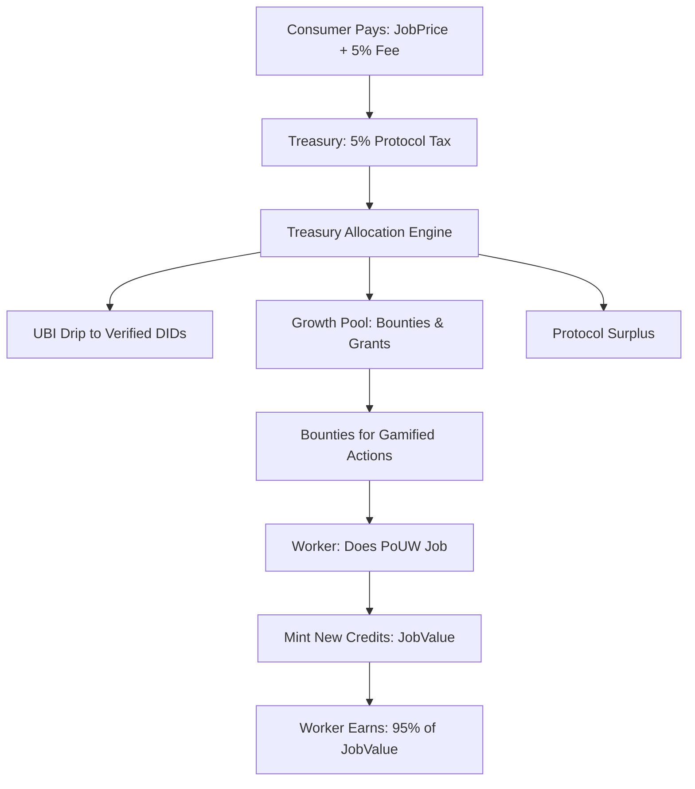

# INOS Economic Architecture & Implementation Plan (Phase 17 Master)
**Document Version:** 1.1
**Core Principle:** Participation-First Economy
**Guarantees:** Liveness (UBI), Productive Work (PoUW), Protocol Sustainability (Protocol Fee), Ecosystem Growth (Incentive Layer).

---

### 1.0 Executive Summary & Core Philosophy
INOS is an economy engineered for **Velocity, Utility, and Sustainable Growth**. Value is created solely through verifiable, productive work (Proof-of-Useful-Work, PoUW) and is distributed to ensure network health, participant welfare, and long-term development.

**The Four Pillars:**
1.  **Liveness (UBI):** A universal basic income drip to all verified human participants (DIDs), ensuring a baseline of economic activity and security.
2.  **Productive Work (PoUW):** The primary minting mechanism. Credits are created only upon proof of completed useful work (compute, storage).
3.  **Protocol Sustainability (The Protocol Fee):** A small, fractional fee on all economic activity, funding the protocol's treasury and future.
4.  **Ecosystem Growth (The Incentive Layer):** Targeted rewards (bounties, multipliers, royalties) for behaviors that strengthen the network's resilience, utility, and developer ecosystem.

---

### 2.0 The Economic Flywheel: Earning, Spending, Governing
A closed-loop system where every action reinforces the network's health.



**A. Earning (Value Minting & Rewards)**
*   **The Worker:** Executes verifiable ML, storage, or compute jobs.
    *   **Reward:** `JobValue * 0.95` (minted as new credits).
*   **The Contributor:** Earns from the Incentive Layer (Section 3.0).
    *   **Reward:** `BountyValue` or `RoyaltyFee` (paid from Treasury's Growth Pool).

**B. Spending (Value Circulation & Burning)**
*   **The Consumer:** Requests and pays for work.
    *   **Cost:** `JobPrice + GasFee`.
    *   **Effect:** Credits are transferred to Worker and Treasury (fee). Gas is burned.

**C. The Treasury (Protocol Engine)**
*   **Inflow:** 5% Protocol Tax on all job payments and transfers (network GDP).
*   **Outflow Allocation:**
    1.  **UBI Reserve (Priority):** Funds the continuous Liveness drip to verified DIDs.
    2.  **Growth Pool:** Finances bounties, grants, and strategic incentives.
    3.  **Protocol Surplus:** Retained for security, governance, and future development.

---

### 3.0 The Incentive Layer: Gamification & Bounties
The Kernel tracks key metrics and automatically rewards "Good Citizenship" that enhances network value.

| Role | Goal | Metric & Trigger | Reward Mechanism |
| :--- | :--- | :--- | :--- |
| **The Connector** | Maximize network distribution & resilience. Every device is a node of strength. | Link a new, validated device to a DID's Device Graph. | **+0.1% UBI Multiplier** per verified device. **No cap.** (10 devices = +1.0%, 100 devices = +10.0%). |
| **The Power Plant** | Guarantee high-availability resource supply. | Maintain >99.9% uptime for a resource-providing device over an epoch (e.g., 7 days). | **"Uptime Bonus"** – a fixed credit bounty paid from the Growth Pool. |
| **The Developer** | Incentivize creation of valuable modules/patterns. | A user instantiates a module from a published `PatternID`. | **"Royalty"** – a micro-fee (e.g., 0.1-1% of job cost) paid from the consumer to the pattern's author. |
| **The Janitor** | Maintain data integrity and system hygiene. | Successfully complete a verified maintenance task (e.g., proof of data cleanup, hash verification). | **"Micro-Bounty"** – a small, immediate credit payment from the Growth Pool. |

**Key Strategic Implications of the Connector Change:**
1.  **Exponential Resilience:** Each device strengthens the Device Graph, making the network more attack-resistant and fault-tolerant.
2.  **Viral Growth Loop:** Participants are financially incentivized to onboard their other devices (phones, tablets, PCs, IoT) and even recruit others, as each new device directly boosts their UBI.
3.  **Supply-Side Scaling:** More devices = more potential compute/storage nodes for PoUW, increasing network capacity organically.
4.  **Anti-Sybil Protection:** The requirement for **validated device linkage** (cryptographic proof of distinct hardware) prevents fake device inflation. The Device Graph itself becomes the trust anchor.

---

### 4.0 Identity & Security Foundation: The Device Graph
*   **Root Identity:** Decentralized Identifier (`did:inos:<unique-id>`).
*   **Authentication Model:** Device Graph, a web of trusted devices linked to a DID.
*   **Key Management:** **No seed phrases.** Uses threshold signature schemes (TSS) for key generation and signing.
*   **Recovery:** Threshold recovery via social/device multi-sig, requiring a subset of pre-approved devices or contacts.

---

### 5.0 Technical Specification: Ledger Schema
**File:** `protocols/schemas/economy/v1/ledger.capnp`
```capnp
@0xc42e032179831952;

struct Wallet {
  publicKey @0 :Data;
  balance @1 :UInt64;
  did @2 :Text;

  # Incentive Layer Stats
  reputationScore @3 :Float32;
  linkedDevicesCount @4 :UInt16; # Updated to UInt16 for unbounded growth
  uptimeScore @5 :Float32;
  lastUbiClaim @6 :Int64;
}

struct Transaction {
  id @0 :Text;
  fromDid @1 :Text;
  toDid @2 :Text; # Special: "Treasury", "BountyPool"
  amount @3 :UInt64;
  protocolFee @4 :UInt64;

  timestamp @5 :Int64;
  type @6 :TransactionType;

  enum TransactionType {
    transfer @0;
    poUWCompletion @1; # Worker reward mint
    protocolFeeCollection @2;
    ubiDistribution @3;
    bountyPayout @4;
    royaltyPayout @5;
    deviceLink @6;
  }

  # Context for incentives/auditing
  workId @7 :Text; # For PoUW
  bountyId @8 :Text; # For Incentive Layer
  patternId @9 :Text; # For Royalties
}
```

---

### 6.0 Implementation Roadmap (Phase 17)
**Objective:** Launch the core economic engine with the Protocol Fee and basic Incentive Layer.

**Phase 17.A: Foundation (The Central Bank)**
*   **Deliverable 1:** Integrate `ProtocolFee` module into core transaction flow. All `poUWCompletion` and `transfer` transactions levy a 5% fee to `Treasury`.
*   **Deliverable 2:** Implement `Treasury` smart contract with split logic: automatic UBI drip, isolated Growth Pool, surplus accounting.
*   **Milestone:** Economy v1 live. Value creation is taxed; Treasury begins accruing funds.

**Phase 17.B: Gamification Engine**
*   **Deliverable 3:** Build `kernel/economics/incentives/tracker` to monitor: device linkage, uptime, pattern usage.
*   **Deliverable 4 (Updated):** Implement `AchievementSystem` with rule engine.
    *   **Rule:** `UBI_Multiplier = 1.0 + (wallet.linkedValidatedDevicesCount * 0.001)`
    *   **Trigger:** On each successful `deviceLink` transaction, recalculate and apply the new multiplier to the DID's next UBI drip.
*   **Deliverable 5:** Implement `RoyaltyHook` in module spawner. On `SpawnModule(PatternID)`, query registry for `AuthorID` and execute `royaltyPayout`.
*   **Milestone:** Incentive Layer active. Contributors automatically earn for resilience and development.

**Phase 17.C: Integration & Onboarding**
*   **Deliverable 6:** Build `UsefulWorkBridge`: Connect `MLSupervisor` job completion signals to `EconomicsEngine.mintCredits()`.
*   **Deliverable 7:** **The Mining Bootstrap**: Integrate `mining` module with Economics Engine. Enable solo/pool mining to provide initial network liquidity and credit generation during idle cycles.
*   **Deliverable 8:** Create user dashboards showing UBI status, gamification stats, and Treasury metrics.
*   **Milestone:** Full economic flywheel operational. Users can see, earn, and understand the new economy.
